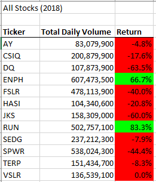

# VBA Challenge

Overview of Project
For this challenge we used VBA to compare 2017 and 2018 stocks.

Results
* I found that overall the 2017 stocks performed better than in 2018. 

ENPH and Run were the only ones that performed well on 2018 compared to the other companies. 

"ENPH" was the only company that performed well in both years. 

"TERP" is the worst performing company given that it has negative returns in both years. 

What are the advantages and disadvantages of refactoring code?
The advantage of refactoring is that it makes the information more clear and easy to understand and read.

The Disadvantage is that it is a longer process  and you can find more bugs and you need to run it a lot of times to make sure you are coding correctly. It is also complicated to determine the correct code you should use.

How do these pros and cons apply to refactoring the original VBA script?
The pros of refactorings were that we were able to read and understand better the information and to find the relevant information easier. The cons of refactoring is that we needed to follow a lot of steps and make sure that the coding is correct while running it a lot of times.
